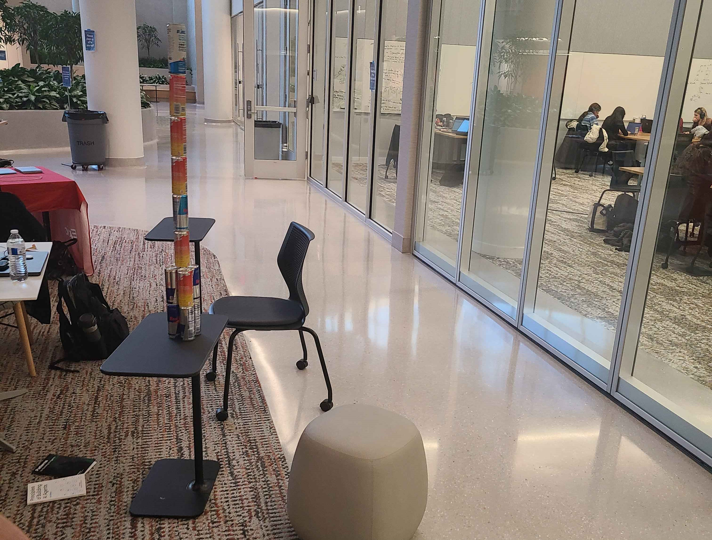
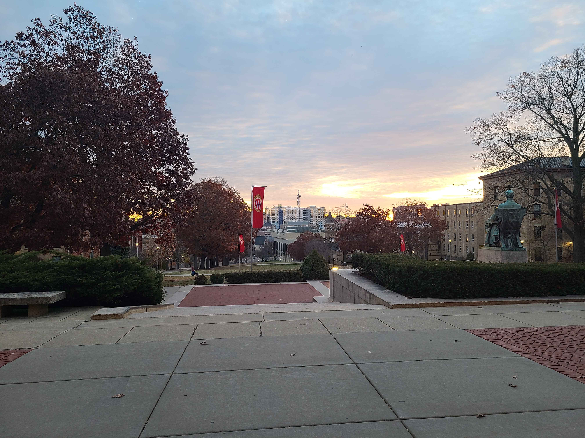

I was a participant in MadHacks 2025! I am still working on a post about the experience, but you can
check out the project my team and I made <a href="https://devpost.com/software/graph-4m" target="_blank">here</a>
and view the pictures I took of the experience below!

The large screen at the entrance of Morgridge Hall running Windows 11

Me on the local news thinking very intensely

The record stack of 8 energy drinks

The final form of Graph-4M's explore page

View of Lake Mendota on an early morning jog

An impressive sunrise in front of Bascom Hall to start the day
